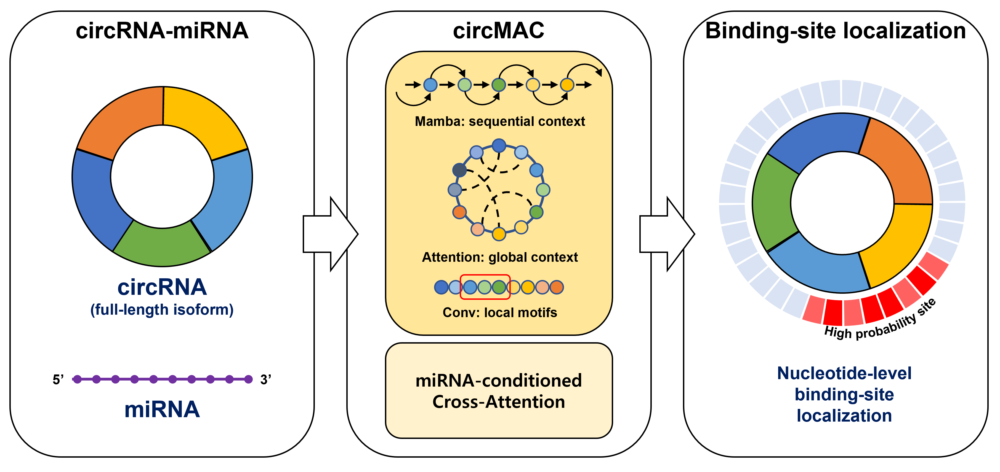

# circMAC: miRNA-Conditioned Binding-Site Localization on Circular RNA Isoforms

[](https://pytorch.org/)
[](LICENSE)

<p align="center">
  
</p>

## Overview

**circMAC** is a deep learning framework for miRNA-conditioned nucleotide-level binding-site localization on circular RNA (circRNA) isoforms.

Given a full-length circRNA isoform sequence and a paired mature miRNA sequence, circMAC predicts the probability that each circRNA nucleotide belongs to a miRNA-binding region. The model is designed to capture complementary global, sequential, and local sequence features while preserving sequence continuity across the back-splice junction (BSJ).

## Model Architecture

circMAC consists of four main components:

1. **Multi-scale circRNA encoder**  
   The full-length circRNA sequence is processed through downsampling, stacked encoder layers, and upsampling with a residual connection.

2. **Three-branch circMAC block**  
   Each encoder layer integrates complementary sequence representations:
   - **Attention branch** for global context modeling
   - **Mamba branch** for efficient sequential modeling
   - **Convolution branch** for local motif extraction with circular padding

3. **miRNA-conditioned cross-attention**  
   The encoded circRNA representation attends to the paired miRNA representation, allowing each circRNA position to be evaluated in a miRNA-specific context.

4. **Nucleotide-level site prediction head**  
   A Conv1D-based prediction head produces a binding-site probability for each circRNA nucleotide.

## Self-Supervised Pretraining

circMAC supports three self-supervised pretraining objectives:

| Objective | Description |
|---|---|
| **MLM** | Masked Language Modeling: reconstructs masked nucleotide tokens |
| **SSP** | Secondary-Structure Prediction: predicts paired or unpaired states at each position |
| **BPP** | Base-Pairing Prediction: reconstructs the nucleotide–nucleotide base-pairing matrix |

Among the evaluated objectives, **BPP pretraining** achieved the strongest downstream binding-site localization performance and is used as the main circMAC configuration.

## Repository Structure

```text
.
├── assets/
│   └── graphical_abstract.png     # Overview figure for the README
├── data/
│   ├── df_circ_ss.pkl             # Pretraining dataset
│   ├── df_train_final.pkl         # Supervised training dataset
│   └── df_test_final.pkl          # Supervised test dataset
├── models/
│   ├── circmac.py                 # Proposed circMAC encoder
│   ├── model.py                   # Model wrapper
│   ├── heads.py                   # Prediction heads
│   ├── modules.py                 # Shared neural network modules
│   ├── pretrainedmodel.py         # Pretrained RNA language model wrappers
│   ├── cnn.py                     # CNN baseline
│   ├── lstm.py                    # LSTM baseline
│   ├── mamba.py                   # Mamba baseline
│   ├── transformer.py             # Transformer baseline
│   ├── hymba.py                   # Hymba baseline
│   └── rope.py                    # Positional encoding utilities
├── data.py                        # Dataset classes and data utilities
├── pretraining.py                 # Self-supervised pretraining entry point
├── training.py                    # Supervised fine-tuning entry point
├── trainer.py                     # Training and evaluation logic
├── utils.py                       # Data processing and utility functions
├── utils_config.py                # Model configuration
├── requirements.txt               # Python dependencies
└── LICENSE
```

## Installation

```bash
git clone https://github.com/Juseong03/circmac.git
cd circmac

pip install -r requirements.txt
```

A CUDA-enabled environment is recommended for training circMAC and the pretrained RNA language model baselines.

## Data

The processed datasets used in this study are available from the following link:

- [Download the processed datasets from Google Drive](https://drive.google.com/drive/folders/16NcpE4nSw-i7ptvJhCGtUgcEzhqU7VE9?usp=drive_link)

After downloading the files, place them in the `data/` directory:

```text
data/
├── df_circ_ss.pkl
├── df_train_final.pkl
└── df_test_final.pkl
```

The supervised datasets contain full-length circRNA isoforms, paired miRNA sequences, and nucleotide-level binding-site masks. The pretraining dataset contains circRNA isoform sequences and predicted secondary-structure information.

## Usage

### 1. Training without Pretraining

To train circMAC from scratch, omit `--load_pretrained`:

```bash
python training.py \
    --model_name circmac \
    --target mirna \
    --task sites \
    --target_model rnabert \
    --interaction cross_attention \
    --site_head_type conv1d \
    --max_len 1000 \
    --d_model 128 \
    --n_layer 6 \
    --lr 1e-4 \
    --epochs 100 \
    --device 0 \
    --exp circmac_no_pretraining
```
### 2. Pretraining

The following command runs the main structure-aware pretraining configuration:

```bash
python pretraining.py \
    --model_name circmac \
    --data_file df_circ_ss \
    --pairing \
    --max_len 1000 \
    --d_model 128 \
    --n_layer 6 \
    --lr 1e-4 \
    --epochs 300 \
    --device 0 \
    --exp circmac_bpp
```

Run the alternative objectives separately for comparison:

```bash
# Masked Language Modeling
python pretraining.py \
    --model_name circmac \
    --data_file df_circ_ss \
    --mlm \
    --exp circmac_mlm

# Secondary-Structure Prediction
python pretraining.py \
    --model_name circmac \
    --data_file df_circ_ss \
    --ssp \
    --exp circmac_ssp
```

### 3. Fine-Tuning for miRNA Binding-Site Localization

```bash
python training.py \
    --model_name circmac \
    --target mirna \
    --task sites \
    --target_model rnabert \
    --interaction cross_attention \
    --site_head_type conv1d \
    --load_pretrained circmac_bpp \
    --max_len 1000 \
    --d_model 128 \
    --n_layer 6 \
    --lr 1e-4 \
    --epochs 100 \
    --device 0 \
    --exp circmac_bpp_sites
```


## Citation

A manuscript describing circMAC is currently in preparation. Citation information will be updated when available.

## License

This project is licensed under the MIT License. See the [LICENSE](LICENSE) file for details.
